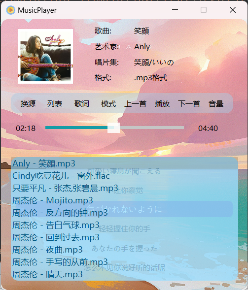
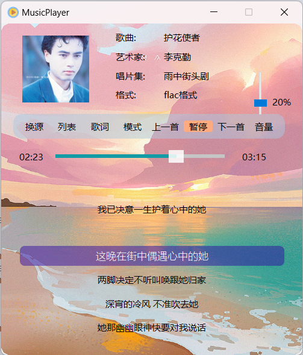
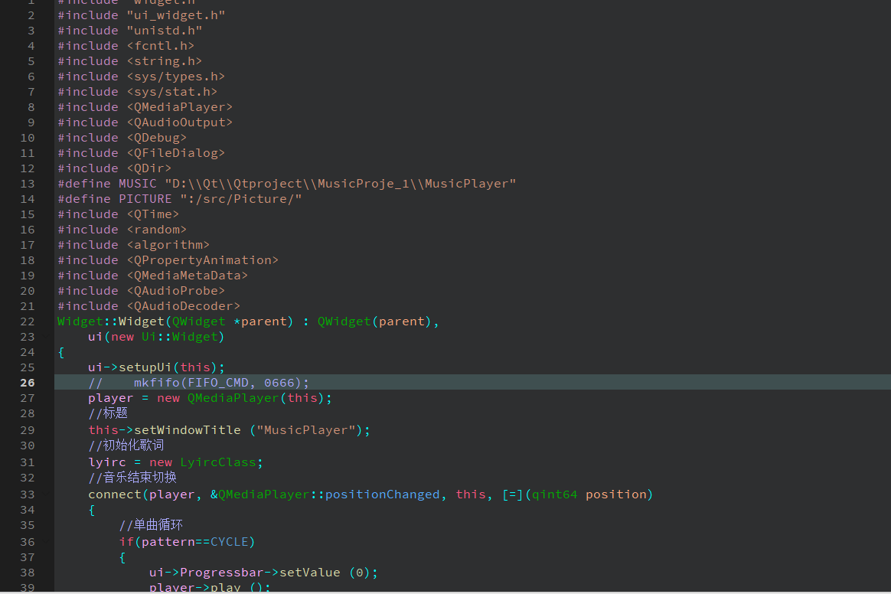

# MyPlayer
基于qt,c++实现的个人音乐播放小项目(源码)
# 主要功能
主要使用QMediaPlayer库添加文件夹进行音乐播放;
实现了进度条控制自动根据音乐时间播放歌词(歌词文件需要自己添加.lrc);
实现了播放器的基本功能 暂停 下一曲上一曲 音量大小 歌词歌单显示等
# 界面预览

# 注意 
音乐播放位置和歌词位置需要根据自己的文件路径进行更改
将宏定义的文件路径改为自己的文件路径即可
